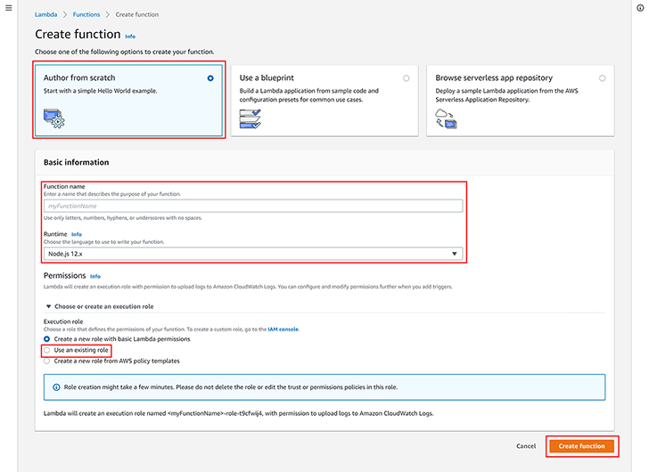
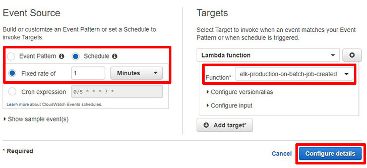
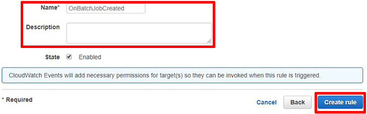
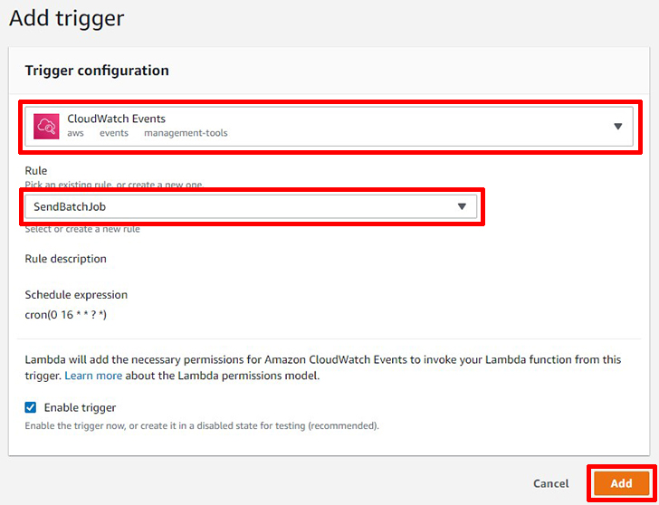

# Pipeline Lambda Functions

배치잡으로 데이터를 추출해서 저장할 수 있는 파이프라인의 일부입니다.

## Outline

- [Installation](#Installation)
- [Scripts](#Scripts)
- [Usage](#Usage)

## Installation

- 의존성 패키지를 설치합니다.

  ```sh
  // using yarn
  yarn

  // using npm
  npm install
  ```

- `.env`를 수정합니다.

  ```sh
  # SQS options
  QUEUE_URL=<QUEUE_URL>
  SQS_ARN=<SQS_ARN>
  MAX_NUMBER_OF_MESSAGES=<MAX_NUMBER_OF_MESSAGES>

  # AWS profile
  PROFILE_NAME=<PROFILE_NAME>
  REGION=<REGION>
  ```

- aws-cli에서 다음과 같은 명령어를 입력후 다음 [링크](http://localhost:49160/devops/2020/01/05/aws-cli.html)를 참고해서 profile을 생성합니다.

  ```sh
  $ aws configure
  ```



- AWS Lambda console에 들어가서 다음과 같은 이름을 가진 함수를 각각 만듭니다. 런타임 버전은 `Node.js 12.x`를 선택합니다. IAM 역할은 Lambda `AdministratorAccess`로 만들어 적용합니다.

  - `elk-production-send-batch-job`
  - `elk-production-on-batch-job-created`

- AWS CloudWatch console에서 `Rules`로 들어갑니다.

  - `Create rule`을 클릭합니다.

  

  - `Event Source`에서 `Schedule`을 선택합니다.
  - `Fixed rate of`를 1분으로 설정합니다.
  - `Targets`에서 `Add target`을 클릭합니다.
  - `Lambda function`을 선택한 후 `Function`에서 `elk-production-on-batch-job-created`를 선택합니다.
  - `Configure details`를 클릭합니다.

  

  - 이벤트 이름과 설명을 작성합니다.

  

  - `Create rule`을 클릭합니다.
  - 위의 과정을 `elk-production-send-batch-job`에도 똑같이 반복합니다.
  - 대신 `Schedule`에서 `Cron expression`을 다음과 같이 입력합니다: `0 16 * * ? *`



- AWS Lambda console에서 함수에 이름에 맞는 CloudWatch Events를 트리거로 추가합니다.

- `constant/group`에서 `keywords.ts`, `sites.ts`에서 추출을 원하는 키워드와 원하는 사이트로 변경합니다.

  - 다음은 예시입니다.

    ```ts
    // keywords.ts
    export const groupKeywords = ['구글', '네이버', '야후', '다음', '덕덕고']

    // sites.ts
    export const groupSites = [
      'instagram',
      'daumTistory',
      'daumCafe',
      'daumBlog',
    ]
    ```

<br>

---

<br>

## Scripts

- `npm run serve` / `yarn serve`: `serverless-offline` 플러그인을 사용해 로컬에서도 람다 실행환경과 같은 환경처럼 실행 가능합니다.
- `npm run deploy:prod` / `yarn deploy:prod`: S3와 Lambda fn에 production 스테이지로 배포합니다. `-win`플래그를 스크립트에 붙이면 windows에서도 사용이 가능해집니다.
- `npm run deploy:dev` / `yarn deploy:dev`: S3와 Lambda fn에 dev 스테이지로 배포합니다. `-win`플래그를 스크립트에 붙이면 windows에서도 사용이 가능해집니다.
- `npm run build` / `yarn build`: `.serverless`에 `.zip`파일로 빌드합니다. `-win`플래그를 스크립트에 붙이면 windows에서도 사용이 가능해집니다.

## Usage

오프라인으로 서버를 실행하면 터미널에 다음과 같은 로그가 찍힙니다.


로그에 찍힌 api로 postman을 사용해 테스트가 가능합니다.

- `GET /send-batch-jobs`: 위에서 짜둔 크롤 옵션을 json에 담아 SQS에 메시지로 보냅니다.

  - SQS로 보내는 메시지 형태

    ```json
    {
      "keyword": "KEYWORD",
      "startDate": "START_DATE",
      "endDate": "END_DATE",
      "site": "SITE",
      "_index": "INDEX_NAME"
    }
    ```

  - 응답코드

    - 성공시

      ```json
      { "done": true }
      ```

    - 실패시

      ```json
      {
        "done": false,
        "err": "err msgs"
      }
      ```

* `GET /on-batch-job-created`: SQS에서 원하는만큼의 메시지를 가져와서 크롤러단으로 메시지를 보냅니다. 크롤러가 현재 작업을 처리할 수 있는 상태인지 먼저 확인한 후에 가능하면 보내고, 불가능하면 requeue 처리합니다.

  - SQS에서 가져온 메시지 형태

    ```json
    {
      "MessageId": "MESSAGE_ID",
      "ReceiptHandle": "RECEIPT_HANDLE",
      "MD5OfBody": "MD5_OF_BODY",
      "Body": "{\"keyword\":\"KEYWORD\",\"startDate\":\"START_DATE\",\"endDate\":\"END_DATE\",\"site\":\"SITE\",\"_index\":\"INDEX_NAME\"}"
    }
    ```

  - 응답코드

    - 성공시

      ```json
      { "done": true }
      ```

    - 실패시

      ```json
      {
        "done": false,
        "err": "err msgs"
      }
      ```
